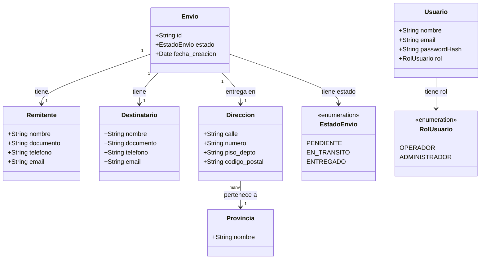

# Diagrama de Dominio — LogiTrack

## Descripción general

LogiTrack es un sistema de gestión de envíos. Su dominio central gira en torno a la entidad **Envío**, que agrupa toda la información de una operación de despacho: quién envía, quién recibe, a dónde va y en qué estado está.

---

## Diagrama (Mermaid)



---

## Entidades y objetos de valor

### Envío _(Aggregate Root)_
Es la entidad central del sistema. Contiene todo lo necesario para representar una operación de despacho. Actúa como **aggregate root**: Remitente, Destinatario y Dirección solo existen en el contexto de un Envío.

| Campo | Tipo | Descripción |
|---|---|---|
| `id` | UUID | Identificador único generado automáticamente |
| `estado` | EstadoEnvio | Estado actual del envío |
| `fecha_creacion` | Date | Fecha en que se registró el envío |

---

### Remitente _(Value Object)_
Representa a la persona que origina el envío. No tiene identidad propia fuera del Envío.

| Campo | Tipo | Descripción |
|---|---|---|
| `nombre` | String | Nombre y apellido |
| `documento` | String | DNI u otro documento |
| `telefono` | String | Número de contacto |
| `email` | String | Correo electrónico |

> El `documento` del remitente debe ser único por envío activo en el sistema.

---

### Destinatario _(Value Object)_
Representa a quien recibe el envío. Misma estructura que Remitente.

| Campo | Tipo | Descripción |
|---|---|---|
| `nombre` | String | Nombre y apellido |
| `documento` | String | DNI u otro documento |
| `telefono` | String | Número de contacto |
| `email` | String | Correo electrónico |

> El `documento` del destinatario debe ser único por envío activo en el sistema.

---

### Dirección _(Value Object)_
Representa el domicilio de entrega. No tiene identidad propia.

| Campo | Tipo | Descripción |
|---|---|---|
| `calle` | String | Nombre de la calle |
| `numero` | String | Numeración |
| `piso_depto` | String | Piso y/o departamento (opcional) |
| `codigo_postal` | String | Código postal |
| `provincia` | Provincia | Provincia de Argentina |

---

### Provincia _(Value Object)_
Representa una provincia de Argentina. Sus valores están fijos en `src/data/provinces.json` (24 provincias).

| Campo | Tipo |
|---|---|
| `nombre` | String |

---

### Usuario _(Entidad — pendiente de implementar)_
La presencia de `bcryptjs` y `jsonwebtoken` en el proyecto indica que el sistema tendrá autenticación. El dominio prevé un Usuario con rol.

| Campo | Tipo | Descripción |
|---|---|---|
| `nombre` | String | Nombre del operador |
| `email` | String | Correo de acceso |
| `passwordHash` | String | Contraseña hasheada con bcrypt |
| `rol` | RolUsuario | Nivel de acceso |

---

### EstadoEnvio _(Enumeración)_

| Valor | Descripción |
|---|---|
| `PENDIENTE` | El envío fue registrado pero aún no se despachó |
| `EN_TRANSITO` | El envío está siendo transportado |
| `ENTREGADO` | El envío llegó al destinatario |

---

### RolUsuario _(Enumeración — pendiente de implementar)_

| Valor | Descripción |
|---|---|
| `OPERADOR` | Puede registrar y consultar envíos |
| `ADMINISTRADOR` | Acceso completo al sistema |

---

## Reglas de negocio del dominio

1. Un **Envío** solo puede existir si tiene Remitente, Destinatario y Dirección completos.
2. El **documento del destinatario** no puede repetirse entre envíos activos en el sistema.
3. El **documento del remitente** no puede repetirse entre envíos activos en el sistema.
4. La **provincia** de la dirección debe pertenecer al listado oficial de provincias argentinas.
5. El **estado** de un envío solo puede avanzar en sentido progresivo: `PENDIENTE → EN_TRANSITO → ENTREGADO`.

---

## Arquitectura del sistema (MVC)

```
HTTP Request
     │
     ▼
 Router (src/routes/)
     │
     ▼
 Middleware de validación (src/middlewares/)
  ├── Valida campos con express-validator
  └── Verifica unicidad de documentos
     │
     ▼
 Controller (src/controllers/)
     │
     ▼
 Model (src/models/)
  └── Lee/escribe en src/data/shipments.json
     │
     ▼
 View (src/views/ — EJS)
```
